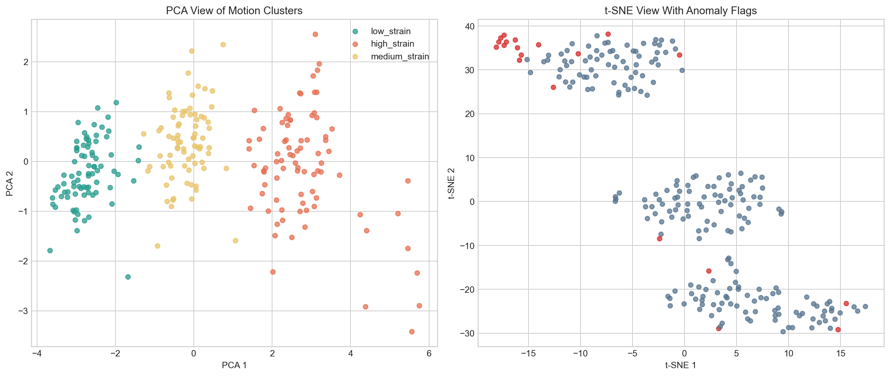

# Motion Pattern Clustering and Injury-Risk Anomaly Detection

Unsupervised learning pipeline for grouping motion into interpretable strain clusters and flagging high-risk movement anomalies. The repository includes a runnable synthetic-data workflow so the clustering, anomaly detection, and visualisation stack can be demonstrated immediately.



## Project Snapshot

- Focus: unsupervised movement analysis for strain profiling and injury-risk review
- Clustering: K-Means plus DBSCAN for density-aware structure and noise
- Risk flagging: Isolation Forest anomaly detection
- Interpretation: PCA and t-SNE visualisations exported to the repo
- Current demo result: 3 interpretable strain bands with 20 flagged anomalies in a 240-sample run

## Why It Matters

In many movement-analysis settings there is limited labelled ground truth. This repo is built around that practical constraint:

- learn structure from unlabelled motion signatures
- separate lower- and higher-strain behavior into interpretable clusters
- surface unusual events that deserve ergonomic or clinical review

## What This Repo Includes

- K-Means clustering for low-, medium-, and high-strain grouping
- DBSCAN for density-based structure and noise detection
- Isolation Forest for high-risk anomaly flagging
- PCA and t-SNE visualisation exports for analysis and reporting
- CLI that writes summary metrics, analysis tables, saved models, and plots

## Quick Start

```bash
python -m pip install -r requirements.txt
python -m pip install -e .
python -m motion_pattern.cli --output-dir reports/demo
```

## Demo Results

| Component | Output |
| --- | --- |
| K-Means | 3 cluster solution mapped to low, medium, and high strain |
| Silhouette score | 0.362 |
| DBSCAN | 2 dense clusters with 132 noise points |
| Isolation Forest | 20 anomaly flags in the demo run |

The strongest flagged samples consistently combine extreme trunk flexion, elevated arm posture, abrupt jerk, and asymmetric loading, which is exactly the kind of interpretable pattern this repo aims to surface.

## Example Outputs

- `reports/demo/summary.json` with clustering and anomaly summaries
- `reports/demo/motion_analysis.csv` with cluster assignments, anomaly scores, and review notes
- `reports/demo/motion_patterns.png` with PCA and t-SNE visualisations
- `reports/demo/unsupervised_models.joblib` containing the fitted demo pipeline
- `models/demo/unsupervised_models.joblib` as the saved reusable demo artifact
- `notebooks/demo_walkthrough.ipynb` for quick analysis in Jupyter

## Project Structure

- `src/motion_pattern/` clustering and anomaly detection code
- `tests/` smoke test for the full demo run
- `reports/` generated plots and summary outputs
- `models/demo/` stored demo model artifact
- `notebooks/demo_walkthrough.ipynb` starter analysis notebook
- `data/` place real movement datasets here
- `models/` reserved for persisted pipelines or exported artifacts

## Replacing The Demo Data

The current synthetic generator creates motion segments with acceleration, jerk, flexion, arm elevation, repetition, load, and asymmetry features. To adapt this to a real dataset, provide a table with the feature columns listed in `src/motion_pattern/pipeline.py` and then reuse the same unsupervised analysis flow.

## Repo Strengths

- Shows applied unsupervised learning, not only supervised classification
- Produces visuals that make the results easier to explain to non-technical reviewers
- Generates interpretable review notes for flagged events
- Useful as a portfolio project for ML, data science, or occupational-health analytics roles
