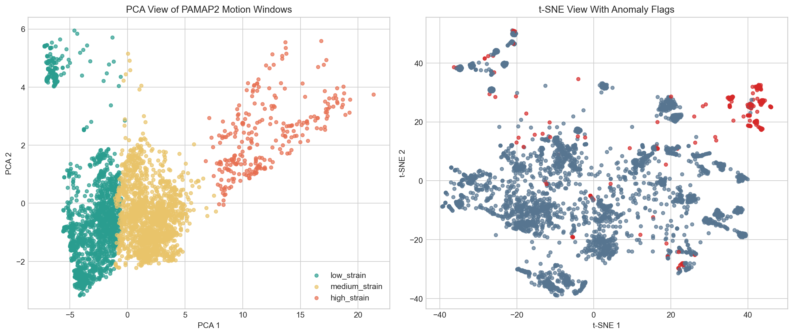

# Motion Pattern Clustering and Anomaly Detection

This repository covers the more exploratory part of the project set: unsupervised analysis of multi-sensor motion data. Instead of predicting predefined classes, it examines whether windowed PAMAP2 signals form meaningful clusters and whether higher-intensity or uncommon movement segments can be highlighted for manual review.

The work is framed as a student research exercise in motion pattern discovery. The outputs should therefore be interpreted as exploratory findings rather than validated injury-risk labels.



## Research question

Can simple unsupervised methods applied to windowed IMU features separate motion patterns into interpretable groups and identify windows that may represent unusually intense or atypical movement?

## Dataset

The study uses the PAMAP2 Physical Activity Monitoring dataset from the raw protocol files under `data/raw/pamap2/`.

For the checked-in run:
- 9 subjects were included
- 3,829 windows were analysed
- hand, chest, and ankle IMU channels were used to build feature vectors

## Method

The pipeline:
- windows the continuous PAMAP2 recordings
- extracts compact per-window summary features
- applies K-Means clustering
- applies DBSCAN for density-based grouping
- applies Isolation Forest for anomaly detection
- exports a review table and PCA/t-SNE visual summaries

The repo also generates short review notes for flagged windows to make qualitative inspection easier.

## Current snapshot

| Component | Result |
| --- | --- |
| Windows analysed | 3,829 |
| K-Means silhouette score | 0.229 |
| Strain bands | 3 learned clusters mapped to low, medium, and high strain |
| DBSCAN | 13 dense clusters with 222 noise windows |
| Isolation Forest | 307 anomaly flags |

The strongest anomaly candidates are dominated by high-intensity activities such as `rope_jumping` and `running`, which is consistent with the motion intensity present in the source signals.

## Reproducing the pipeline

```bash
python -m pip install -r requirements.txt
python -m pip install -e .
python -m motion_pattern.cli --output-dir reports/results --model-dir models/results
```

## Repository outputs

- `reports/results/summary.json`
- `reports/results/motion_analysis.csv`
- `reports/results/motion_patterns.png`
- `models/results/unsupervised_models.joblib`
- `notebooks/real_data_walkthrough.ipynb`

## Limitations

- This is not a clinical injury-risk model.
- The low/medium/high strain labels are inferred from cluster ordering and a simple internal risk score.
- An anomaly flag means "worth reviewing," not "definitely unsafe."
- Raw PAMAP2 files are expected locally under `data/raw/` and are intentionally excluded from version control.
